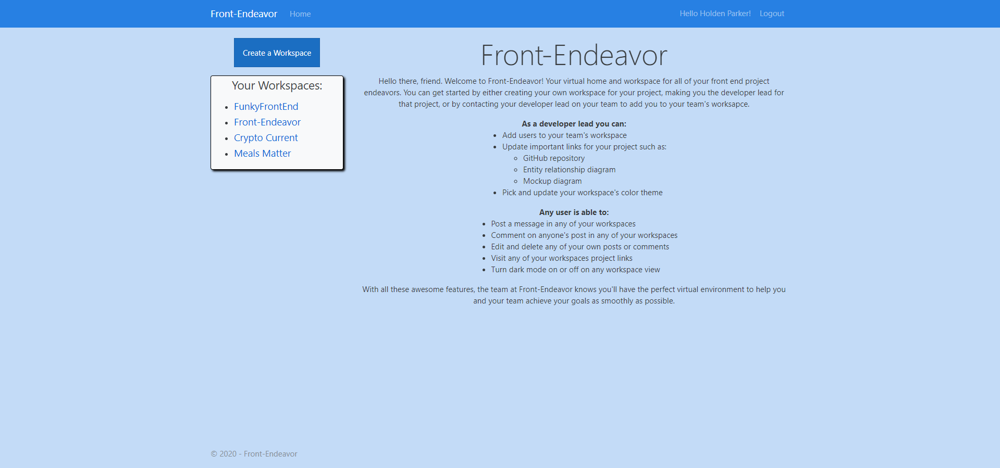
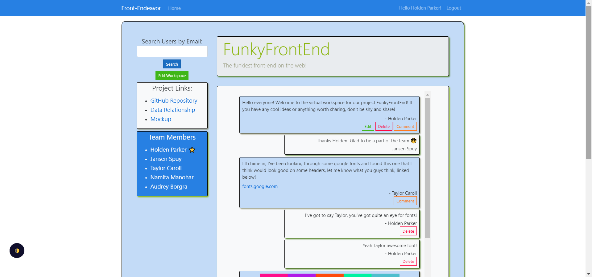
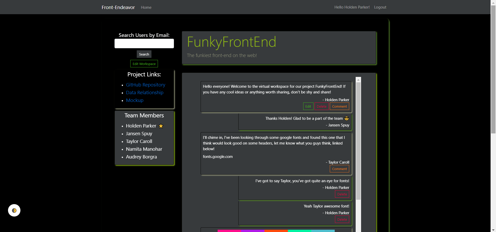

# Front-Endeavor

Front-Endeavor is an application designed for front end developers to have a virtual workspace to brainstorm ideas for on-going projects. The application allows any user to create a workspace for a project, adding any user to that workspace by searching by e-mail. Each workspace has a message board that any team member on that project can post text, an image and/or a URL link in a message for the rest of the team to see and comment on.

- Full CRUD MVC application built with C#, Entity Framework, and ASP.NET
- Using SQL Server as the local database
- Utilized a Bootswatch Bootstrap theme for styling as well as added in the option for dark mode

<!-- images here -->

 
 

## Installation

From your terminal run git clone SSH KEY HERE

Open Visual Studio

Under the tools tab, open the NuGet Package Manager console and run Update-Database to run migrations

Build and run the application after migrations are complete

## Usage

1. Register a new user or sign into an existing account
2. Create a workspace to become a developer lead on that project or get your developer lead to add you to your team's workspace
3. As a developer lead you can edit workspaces and add users to that workspace via email
4. Any user can post messages and comments on a workspace they're a team member on
5. Any user can edit and delete their posts and comments as well
